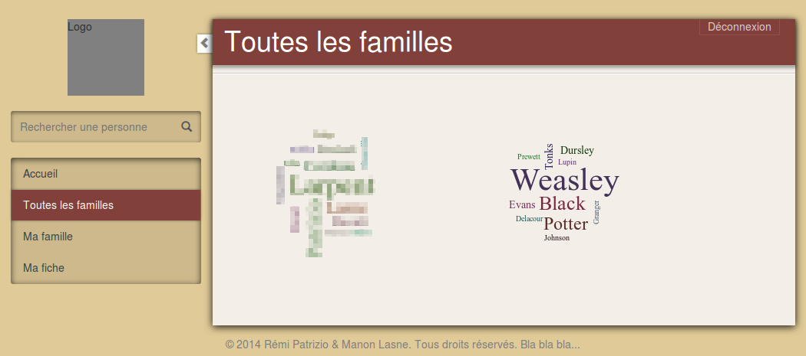
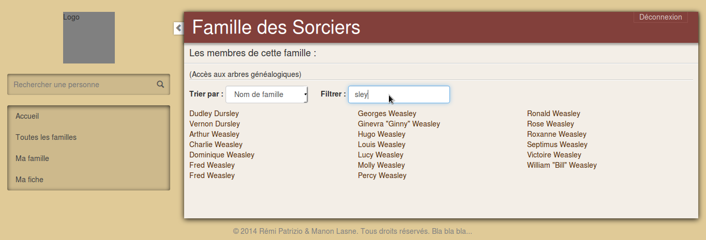
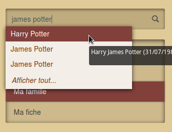
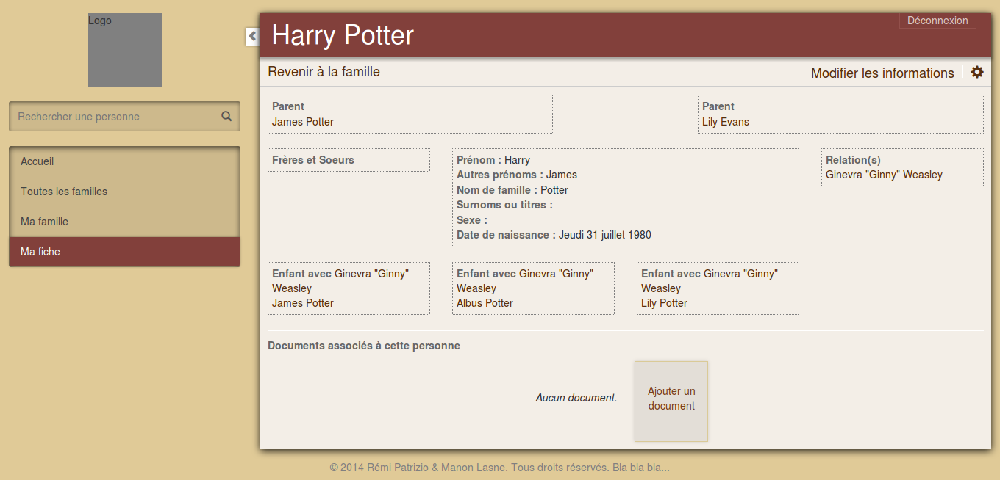
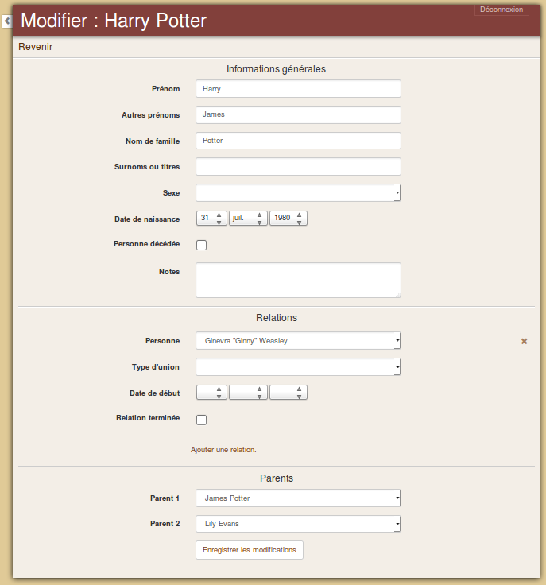
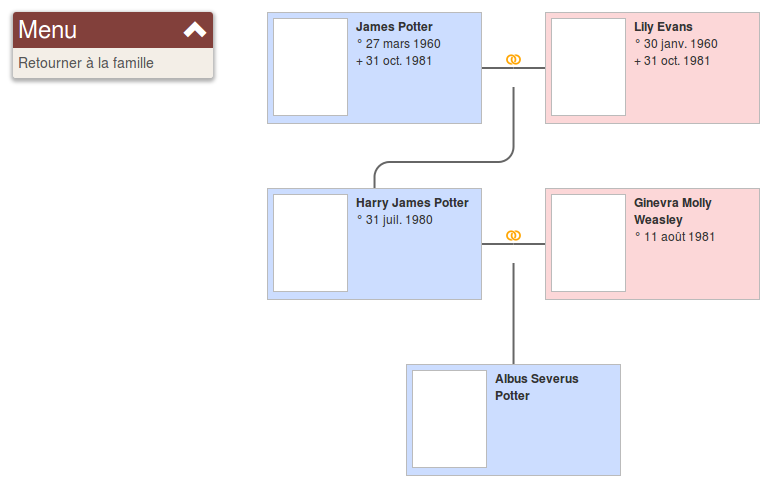

Arbres généalogiques
========================

Ce projet est une site web concu avec le framework php **Symfony 2**.

Il propose de créer des familles, de saisir les membres, leurs informations et leurs relations, afin de générer un arbre généalogique. Chacun peut s'inscrire sur le site et gérer sa propre famille, mais il est aussi possible d'inviter ses proches à rejoindre son propre arbre afin qu'ils l'agrémentent de leurs connaissances. Il pourront à leur tour inviter leurs proches et ainsi l'arbre s'élargira de plus en plus.

Présentation
----------------------------------

_Le site n'est actuellement pas complètement opérationnel, il manque par exemple plusieurs éléments graphiques à divers endroits._

###Inscription

L'utilisateur non connecté est amené à se connecter ou se **créer un compte**. Il a néanmoins accès aux familles qui ont été définies comme "publiques" (dans les captures d'écran qui suivent, la famille de Harry Potter est publique).

Après l'inscription, il peut soit créer son arbre généalogique, soit entrer un code d'accès pour en **rejoindre une existante**.

###Les familles

Dans l'onglet _Toutes les familles_, chaque famille dont on a l'accès est représentée par un **nuage de noms** de famille, en fonction de la fréquence d'apparition du nom dans la famille.

L'onglet _Ma famille_ affiche des liens vers tous les membres de la famille, ainsi que vers les arbres ascendant ou descendant, centrés sur la fiche de la personne connectée.

Il est possible de **trier** les personnes par nom, prénom ou date de naissance, et de **filtrer** les noms et prénoms affichés.

###Moteur de recherche

Un moteur de recherche permet de trouver les personnes selon leurs noms, prénoms, seconds prénoms ou surnoms. On peut rechercher **plusieurs mots en même temps** pour affiner une recherche.

###Les fiches de personnes

Une fiche montre les différentes informations sur une personne, ainsi que des liens vers ses parents, ses frères et soeurs, ses relations et ses enfants.

On peut aussi **uploader des documents** (photos, actes de naissance, de mariage, etc.) qui seront associés à cette personne.

On peut ajouter dynamiquement des relations (ex: mariage) à une personne et définir ses parents. Ce sont ces informations qui permettront de générer l'arbre.

###Arbres généalogiques

On peut afficher les **arbres généalogiques ascendant ou descendant** à partir de n'importe quelle personne.

Voici l'arbre ascendant très simple d'Albus Potter, le deuxième fils de Harry et Ginny.

Installation
----------------------------------

[Cliquez ici](doc/installation.md "Installation") pour accéder à la page d'aide à l'installation.
